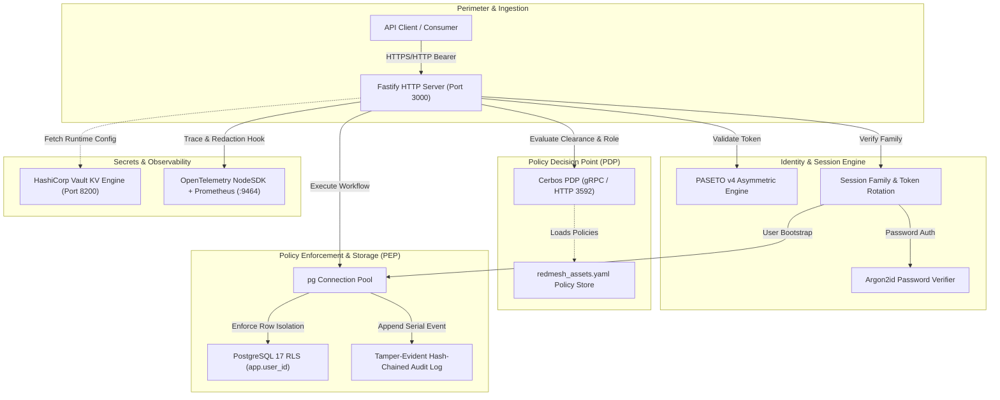
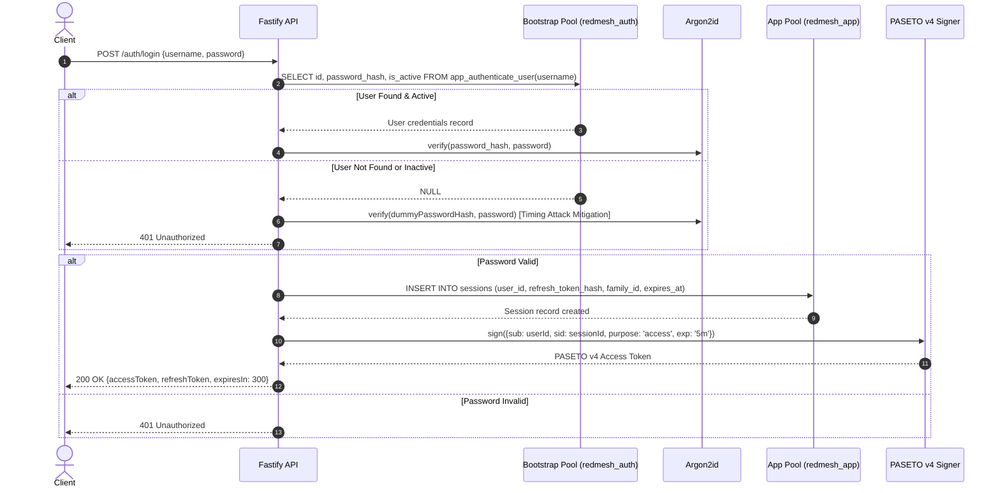
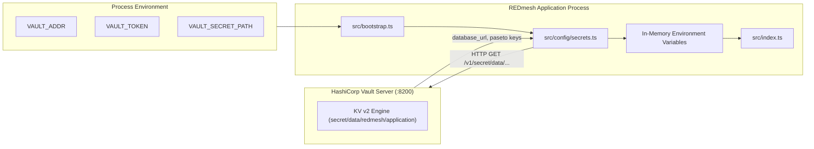

# Technical Architecture Specification: Sovereign SecureMesh (REDmesh)

## 1. System Overview

Sovereign SecureMesh (REDmesh) is a defense-inspired zero-trust resource provisioning platform. It coordinates identity validation, policy-driven authorization, multi-tenant row isolation, dual-custody access lifecycle management, and cryptographic audit records.

Rather than relying on perimeter firewalls or a single policy check at an API gateway, REDmesh structures each security domain into dedicated, decoupled components. Each component enforces a specific security responsibility and assumes that other layers may be subjected to adversarial inputs or partial failure.



---

## 2. Trust Boundaries

REDmesh defines six explicit trust boundaries. Data traversing any boundary must be validated, sanitized, and scoped:

```
Boundary 1: Client           ──────[ Untrusted Network ]──────> Fastify API
Boundary 2: Fastify API      ──────[ Cryptographic Verify ]───> PASETO Identity Subsystem
Boundary 3: Fastify API      ──────[ Internal RPC/HTTP ]──────> Cerbos Authorization Engine
Boundary 4: Fastify API      ──────[ Transactional Session ]──> PostgreSQL 17 (RLS Engine)
Boundary 5: Fastify API      ──────[ Authenticated HTTP ]─────> HashiCorp Vault Secrets
Boundary 6: Fastify API      ──────[ Out-of-Band Channel ]────> OpenTelemetry / Prometheus
```

### Boundary 1: Client $\rightarrow$ API
* **Trust Level:** Untrusted to semi-trusted.
* **Threats:** Malformed JSON, credential stuffing, expired or forged bearer tokens, parameter tampering.
* **Mitigation:** Strict route parameter parsing, Fastify payload validation, Bearer token extraction, automated sensitive field redaction in pino logs.

### Boundary 2: API $\rightarrow$ Authentication Subsystem
* **Trust Level:** Controlled application layer.
* **Threats:** Algorithm confusion (`none` or symmetric HMAC confusion), token tampering, token replay past expiration.
* **Mitigation:** PASETO v4.public with Ed25519 asymmetric cryptography; tokens are strictly validated for `purpose == 'access'`, issuer, audience, and 5-minute time-to-live (TTL).

### Boundary 3: API $\rightarrow$ Cerbos Policy Engine
* **Trust Level:** Internal secure network channel (localhost / service mesh).
* **Threats:** Spoofed principal attributes, policy misconfigurations, clearance bypass.
* **Mitigation:** Principal attributes (`roles`, `clearance`, `unit_id`) are extracted solely from validated database session state—never from client headers. Cerbos runs as an isolated process receiving standardized JSON check payloads.

### Boundary 4: API $\rightarrow$ PostgreSQL Database Engine
* **Trust Level:** Internal database connection with dual-role separation (`redmesh_auth` vs. `redmesh_app`).
* **Threats:** Insecure Direct Object References (IDOR/BOLA), cross-tenant data exfiltration, unauthorized direct table modification.
* **Mitigation:** Connection pooling executes transactions under `redmesh_app` with `FORCE ROW LEVEL SECURITY`. Every tenant query is preceded by `SELECT set_config('app.user_id', $1, true)`. Missing or empty `app.user_id` fails closed (0 rows returned).

### Boundary 5: Application $\rightarrow$ HashiCorp Vault
* **Trust Level:** Secure orchestration infrastructure.
* **Threats:** Hardcoded credentials in source control, environment file leakage.
* **Mitigation:** Ephemeral bootstrap credentials authenticate against Vault KV v2 REST API (`VAULT_ADDR`, `VAULT_TOKEN`). Secrets (`database_url`, `paseto_secret_key`) are loaded into process memory at bootstrap.

### Boundary 6: Application $\rightarrow$ Observability Stack
* **Trust Level:** Out-of-band monitoring infrastructure.
* **Threats:** Credential leakage in metrics or trace spans.
* **Mitigation:** OpenTelemetry records structural trace IDs and span IDs without payload bodies. Loggers redact tokens and password hashes before emission.

---

## 3. Core Architectural Distinctions

A fundamental design tenet of REDmesh is that **no security component doubles as another**:

| Subsystem | Sole Responsibility | What It Is NOT |
| :--- | :--- | :--- |
| **PASETO v4** | Cryptographically asserts the caller's identity (`sub`) and session (`sid`). | Not an authorization engine. A valid token does not confer permission to perform any business action. |
| **Cerbos** | Evaluates policy rules against principal and resource attributes (ABAC). | Not a data filter or database isolation mechanism. Cerbos does not filter SQL result sets. |
| **PostgreSQL RLS** | Isolates rows at the database storage engine by unit and ownership. | Not a business policy engine. RLS does not evaluate organizational rank hierarchies or complex action rules. |
| **Audit Chain** | Provides tamper evidence through sequential cryptographic hash linking. | Not an active security filter or firewall. It cannot block an in-flight malicious request. |
| **OpenTelemetry** | Provides operational telemetry, request tracing, and latency monitoring. | Not an audit integrity or security verification mechanism. Traces can be sampled or dropped without affecting audit state. |
| **HashiCorp Vault**| Centralizes secret storage and runtime distribution. | Not a runtime application authorization service. |

> [!IMPORTANT]
> **Complementary Boundaries:** Cerbos is **not** a replacement for database isolation, and PostgreSQL RLS is **not** a replacement for application authorization. If a developer accidentally omits a Cerbos check, RLS still prevents the user from accessing rows outside their unit. If an RLS policy fails, Cerbos still denies unauthorized actions.

---

## 4. Authentication & Session Architecture

Authentication in REDmesh combines memory-hard credential verification, stateless access tokens, stateful session families, and automatic refresh token reuse detection.



### Password Verification & Timing Attack Mitigation
* Passwords are encrypted using **Argon2id** (`type: argon2.argon2id`).
* When an unknown username or inactive user is provided, `authenticate()` does not return immediately. Instead, it awaits `verifyPassword(dummyPasswordHash, password)`. This normalizes CPU execution time, preventing username enumeration through response latency analysis.

### Token Architecture
1. **Access Token:**
   * Format: PASETO v4.public (asymmetric Ed25519 signature).
   * Lifetime: 5 minutes (`300` seconds).
   * Claims: `sub` (User UUID), `sid` (Session UUID), `purpose: 'access'`, `iss: 'redmesh-api'`, `aud: 'redmesh'`, `iat`, `exp`.
   * Stateless verification: Verified using `PASETO_PUBLIC_KEY` without database access for cryptographic validity, followed by session active check.
2. **Refresh Token:**
   * Format: Cryptographically random 32 bytes encoded as `base64url` (48 bytes on refresh rotation).
   * Storage: Stored only as a **SHA-256 hash** (`refresh_token_hash`) in the `sessions` table.
   * Lifetime: 30 days.

### Refresh Rotation & Reuse Detection
* When `/auth/refresh` is called, the provided refresh token is hashed and looked up via `app_find_session_by_refresh_token(hash)`.
* **Reuse Detection:** If a revoked session is presented for refresh, REDmesh identifies this as a potential session hijack. It immediately revokes the **entire session family** (`WHERE family_id = $1 AND revoked_at IS NULL`), instantly invalidating all descendant tokens.
* **Legitimate Rotation:** If the session is active and unexpired, a new session is created within the same `family_id`, the old session is marked revoked with `replaced_by_session_id`, and new access and refresh tokens are returned.

---

## 5. Authorization Engine (Cerbos ABAC)

REDmesh uses Cerbos (v0.55.0) as an external Policy Decision Point (PDP).

### Policy Specification: `redmesh:asset`
The Cerbos policy (`cerbos/policies/redmesh_assets.yaml`) evaluates actions against the `redmesh:asset` resource type based on principal clearance levels and roles:

* **Clearance Hierarchy:**
  * `CONFIDENTIAL` = 1
  * `SECRET` = 2
  * `TOP_SECRET` = 3

* **Role Matrix:**
  * `ADMIN`: Unrestricted wildcard access (`actions: ["*"]`).
  * `COMMANDER`: Permitted actions: `asset:view`, `asset:request`, `asset:approve`, `asset:reject`, `asset:provision`, `asset:revoke`. Requires matching `unit_id` and `principal.clearance_level >= resource.classification_level`.
  * `AUDITOR`: Permitted actions: `asset:view`. Requires matching `unit_id` and `principal.clearance_level >= resource.classification_level`.
  * `MECHANIC`: Permitted actions: `asset:view`, `asset:request`. Requires matching `unit_id` and `principal.clearance_level >= resource.classification_level`.
  * `CONTRACTOR`: Permitted actions: `asset:view`, `asset:request`. Requires matching `unit_id` and `principal.clearance_level >= resource.classification_level`.

### Authorization Dispatch
When a protected route executes, `authorizeAssetAction(user, asset, action)` constructs the canonical Cerbos request:
* Principal attributes: `unit_id`, `clearance`, `clearance_level`, `roles`.
* Resource attributes: `unit_id`, `classification`, `classification_level`, `asset_type`, `state`.
* If Cerbos responds with anything other than `EFFECT_ALLOW`, the API immediately terminates the request with `403 Forbidden`.

---

## 6. PostgreSQL Row-Level Security (RLS) Model

Database isolation enforces tenant boundaries inside the storage engine using PostgreSQL 17 Row-Level Security.

### Dual Connection Pools
To prevent privilege escalation, the application maintains two isolated connection pools:
1. `bootstrapPool` (role `redmesh_auth`):
   * Strictly limited to executing `app_authenticate_user(p_username)` and `app_find_session_by_refresh_token(p_hash)`.
   * Has `REVOKE ALL ON ALL TABLES IN SCHEMA public`.
2. `appPool` (role `redmesh_app`):
   * Standard connection pool for all business routes.
   * Subject to `FORCE ROW LEVEL SECURITY` on all tables.

### Session Context Injection
Every authenticated operation executes within a transaction managed by `withRlsContext(userId, callback)`:
```sql
BEGIN;
SELECT set_config('app.user_id', $1, true); -- true marks setting transaction-local
-- Executed queries
COMMIT; -- Context automatically discarded
```

### RLS Policies
* **`users` Table:**
  * `users_self_select`: Users can only SELECT their own record (`id = app_current_user_id()`).
* **`user_roles` Table:**
  * `user_roles_self_select`: Users can only SELECT their own assigned roles (`user_id = app_current_user_id()`).
* **`assets` Table:**
  * `assets_same_unit_select`: Users can only SELECT assets located in their own unit (`unit_id = app_current_user_unit_id()`). Cross-unit queries return 0 rows, resulting in an HTTP `404 Not Found`.
* **`access_requests` Table:**
  * `access_requests_requester_select`: Requesters can see their own requests (`requester_id = app_current_user_id()`).
  * `access_requests_requester_insert`: Requesters can insert requests where `requester_id = app_current_user_id()`.
  * `access_requests_commander_select`: Users with role `COMMANDER` can select requests for assets in their own unit.
  * `access_requests_commander_update`: Users with role `COMMANDER` can update requests for assets in their own unit.
* **`provisioning_records` Table:**
  * `provisioning_records_user_select`: Users can view provisioning records assigned to them (`user_id = app_current_user_id()`).
  * `provisioning_records_commander_select` & `commander_insert` & `commander_update`: Commanders can inspect and manage provisioning records for assets in their unit.
* **`audit_events` Table:**
  * `audit_events_auditor_select`: Restricted to users possessing the `AUDITOR` or `ADMIN` role (`app_has_role('AUDITOR') OR app_has_role('ADMIN')`).

---

## 7. Resource Provisioning Workflow

The provisioning subsystem enforces strict dual-control separation between requestors and approvers:

```
[Available Asset]
       ↓
[Mechanic creates Access Request] ──> Status: PENDING
       ↓
[Commander Reviews Request]
       ├──> Status: REJECTED  ──> Workflow Terminates
       └──> Status: APPROVED
              ↓
[Commander Provisions Asset]     ──> Status: PROVISIONED (Record Created)
              ↓
[Commander Revokes Access]       ──> Status: REVOKED (Provisioning Closed)
```

1. **Step 1 — Request (`POST /assets/:id/requests`):**
   * Caller must have `asset:request` permission in Cerbos.
   * Access request record is inserted with `status = 'PENDING'`.
   * Audit event `access_request.created` is appended.
2. **Step 2 — Approval / Rejection (`POST /access-requests/:id/approve` or `reject`):**
   * Caller must have `asset:approve` or `asset:reject` permission in Cerbos (`COMMANDER` role).
   * Request status transitions from `PENDING` to `APPROVED` or `REJECTED`.
   * Audit event `access_request.approved` or `access_request.rejected` is appended.
3. **Step 3 — Provisioning (`POST /access-requests/:id/provision`):**
   * Request must be in `APPROVED` status.
   * Caller must have `asset:provision` permission in Cerbos (`COMMANDER` role).
   * Unique constraint `provisioning_records_access_request_unique` guarantees an access request can be provisioned at most once.
   * Audit event `provisioning.created` is appended.
4. **Step 4 — Revocation (`POST /provisioning/:id/revoke`):**
   * Caller must have `asset:revoke` permission in Cerbos (`COMMANDER` role).
   * Status transitions to `REVOKED`, and `revoked_at` is stamped with `NOW()`.
   * Audit event `provisioning.revoked` is appended.

---

## 8. Tamper-Evident Cryptographic Audit Chain

All security events are appended to a cryptographic hash chain stored in the `audit_events` table.

### Event Canonicalization (`canonicalizeV1`)
To prevent delimiter collision or parser manipulation, every event field is canonicalized using byte-length-prefixed encoding:
$$\text{canonicalValue}(v) = \begin{cases} \text{"-1:"} & v = \text{null} \\ \text{len}(v) + \text{":"} + v & v \neq \text{null} \end{cases}$$

The full canonical string concatenates all fields in deterministic order:
```
schema_version=1:1|chain_position=<len>:<pos>|occurred_at=<len>:<timestamp>|actor_user_id=<len>:<uuid>|action=<len>:<act>|resource_type=<len>:<type>|resource_id=<len>:<id>|result=<len>:<res>|reason=<len>:<reason>|request_id=<len>:<req>|trace_id=<len>:<trace>|previous_hash=<len>:<prev>
```

### Hash Linkage & Invariance
* **Genesis Event:** The initial event has `previous_hash = NULL` (encoded as `-1:`).
* **Successor Events:** Each subsequent event records `previous_hash` equal to the `current_hash` of the row immediately preceding it in `chain_position` order.
* **Hash Calculation:**
  $$\text{current\_hash} = \text{SHA-256}(\text{canonical\_representation})$$

### Tamper Verification (`verifyAuditChain`)
When `/audit/integrity` is invoked by an `AUDITOR` or `ADMIN`, the system scans the entire chain:
1. Asserts `schema_version == 1`.
2. Validates that `event.previous_hash` exactly matches `previousHash` from the prior record.
3. Recomputes `expectedHash = SHA-256(canonicalizeV1(event))` and asserts `event.current_hash == expectedHash`.
4. If any record fails, the scan halts immediately, returning `valid: false`, `firstInvalidPosition`, and the specific failure reason (`Previous hash mismatch` or `Current hash mismatch`).

---

## 9. Secret Management Architecture (HashiCorp Vault)

REDmesh uses HashiCorp Vault to eliminate plaintext secrets from configuration files and container images:



1. **Bootstrap Phase:** `src/bootstrap.ts` checks `VAULT_ENABLED`. If enabled, it fetches credentials from Vault path `secret/data/redmesh/application`.
2. **Secrets Injected:**
   * `DATABASE_URL`: Connection string for `redmesh_app`.
   * `DATABASE_BOOTSTRAP_URL`: Connection string for `redmesh_auth`.
   * `PASETO_SECRET_KEY`: Ed25519 private key for token signing.
   * `PASETO_PUBLIC_KEY`: Ed25519 public key for token verification.
3. **Fail-Closed Guarantee:** If Vault is unreachable, unauthenticated, or missing required keys, process startup halts with exit code 1.

---

## 10. Observability & Log Redaction Architecture

### Distributed Tracing (OpenTelemetry)
* `src/instrumentation.ts` initializes the OpenTelemetry NodeSDK prior to any application modules.
* Automatic instrumentations include:
  * `HttpInstrumentation`: Traces incoming HTTP calls.
  * `PgInstrumentation`: Traces PostgreSQL client queries.
  * `FastifyOtelInstrumentation`: Bridges Fastify request lifecycle to active spans.
* Context propagation: On every request, Fastify's `onRequest` hook extracts the active `traceId` and `spanId` from `trace.getActiveSpan()`. This trace ID is injected into every audit log record via `getTraceContext()`, linking operational traces directly to cryptographic audit events.

### Prometheus Metrics
* Exported on a dedicated HTTP port: `http://127.0.0.1:9464/metrics`.
* Metrics include HTTP request durations, active connection pools, and runtime telemetry.

### Sensitive Data Redaction
The Fastify Pino logger is configured with strict redaction paths:
* `req.headers.authorization`
* `req.headers.cookie`
* `headers.authorization`
* `headers.cookie`
* `*.password`
* `*.passwordHash`
* `*.accessToken`
* `*.refreshToken`
* `*.token`
* `*.paseto`

Redacted properties are permanently removed (`remove: true`) before serialization, ensuring secrets never touch log streams.

---

## 11. Security Assumptions & Threat Boundaries

REDmesh operates under the following explicit security assumptions:

1. **Host & Database Kernel Trust:** The operating system host running the Docker daemon and the PostgreSQL server binary are assumed to be uncompromised. An attacker with root execution access to the database container can bypass RLS by connecting directly as superuser.
2. **Cerbos Configuration Integrity:** Cerbos policies stored in `./cerbos/policies` are mounted read-only (`:ro`). The integrity of authorization decisions assumes policy files cannot be modified without deployment authorization.
3. **Database Clock Monotonicity:** Audit timestamps rely on database server time (`clock_timestamp()`). Audit ordering assumes the PostgreSQL host clock does not exhibit severe backward drift.
4. **Single-Node Transaction Serialization:** The audit hash chain relies on PostgreSQL advisory transaction locks (`pg_advisory_xact_lock`). This guarantees write serialization within a single PostgreSQL instance. Distributed multi-region write replication would require distributed consensus before committing audit records.
