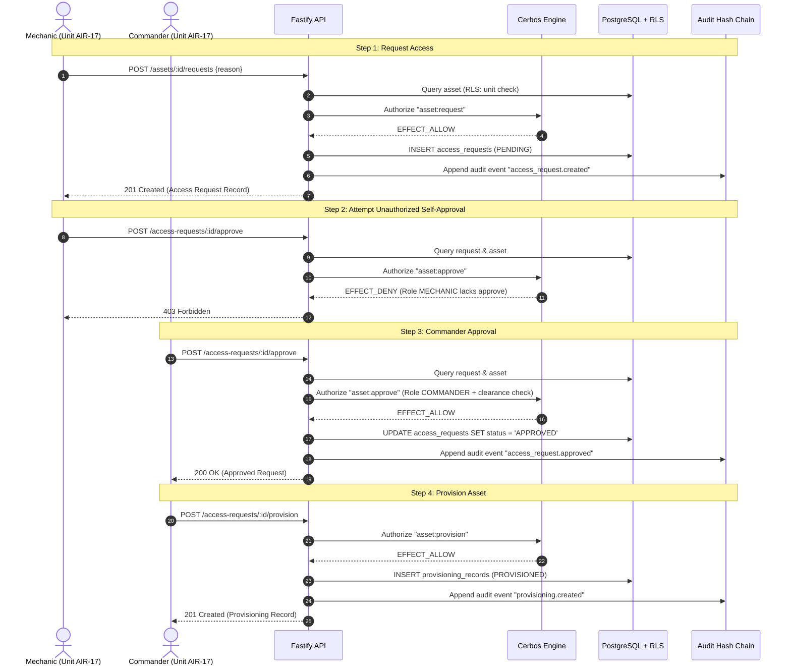

# Sovereign SecureMesh (REDmesh)

> **"Sovereign SecureMesh is a defense-inspired Zero-Trust resource provisioning platform combining PASETO authentication, Cerbos policy-based authorization, PostgreSQL Row-Level Security, tamper-evident cryptographic audit logging, OpenTelemetry observability, Vault-managed secrets, and containerized deployment."**

---

> [!NOTE]
> **Project Disclaimer:** Sovereign SecureMesh is a fictional, defense-inspired software architecture project created for demonstration and educational purposes in zero-trust engineering. It is **not** real military infrastructure, is not affiliated with any defense department or military organization, and does **not** host, handle, or process classified or real military data.

---

## Executive Summary

Modern critical-infrastructure systems require defense-in-depth where no single perimeter failure compromises data confidentiality, operational safety, or audit integrity. Traditional architectures rely predominantly on API gateway checks or application-layer role checks, leaving the persistent store vulnerable to Insecure Direct Object References (IDOR/BOLA) and insider threats.

**Sovereign SecureMesh (REDmesh)** addresses these risks by implementing a strict **Zero-Trust layered security architecture**:
1. **Cryptographic Identity:** Stateless PASETO v4 asymmetric tokens (Ed25519) replace legacy JWTs, immune to signature confusion and weak cipher negotiation.
2. **Decoupled Authorization:** Attribute-Based Access Control (ABAC) enforced by an external Cerbos policy engine evaluating dynamic clearance and resource classifications.
3. **Database Row-Level Security (RLS):** PostgreSQL enforces `FORCE ROW LEVEL SECURITY` with tenant and unit isolation at the storage layer, ensuring cross-unit access fails closed (returning 404/empty) even if application logic were bypassed.
4. **Tamper-Evident Cryptographic Audit Chain:** Every sensitive action is linked in a SHA-256 hash chain with strict canonical encoding, serial transaction locking, and database-level immutability from runtime roles.
5. **Runtime Secret Management:** Infrastructure secrets and database credentials are decoupled from configuration and loaded dynamically from HashiCorp Vault.
6. **Observability & Log Redaction:** Structured logs automatically redact bearer tokens, hashes, and passwords, while OpenTelemetry traces correlate HTTP requests to database queries.

---

## System Architecture

```mermaid
flowchart TD
    Client["Client / API Consumer"]

    subgraph FastifyAPI ["Fastify Application Layer"]
        Entry["HTTP Request Entry (Logging & Redaction)"]
        TraceHook["OpenTelemetry Trace Context Injection"]
        AuthModule["Authentication & Session Validation"]
        AuthzModule["Authorization Dispatcher"]
        Workflows["Resource & Provisioning Handlers"]
    end

    subgraph SecurityEngines ["External Security Services"]
        CerbosEngine["Cerbos Policy Engine (ABAC / Port 3592)"]
        VaultEngine["HashiCorp Vault (Secrets Management / Port 8200)"]
    end

    subgraph StorageLayer ["PostgreSQL 17 Database Layer"]
        AuthRole["redmesh_auth Role (Bootstrap Login)"]
        AppRole["redmesh_app Role (Runtime App Pool)"]
        RLSPolicies["Row-Level Security (FORCE RLS)"]
        AuditChain["Tamper-Evident Audit Chain Table"]
    end

    subgraph ObservabilityStack ["Observability Stack"]
        OTelSDK["OpenTelemetry NodeSDK"]
        PromExporter["Prometheus Metrics (:9464)"]
        SpanExporter["Console Trace Exporter"]
    end

    Client -->|HTTP / Bearer Token| Entry
    Entry --> TraceHook
    TraceHook --> AuthModule
    AuthModule -->|Verify PASETO v4| AuthModule
    AuthModule -->|Validate Session Family| AppRole

    AuthModule --> AuthzModule
    AuthzModule -->|Check clearance & roles| CerbosEngine

    AuthzModule --> Workflows
    Workflows -->|withRlsContext(app.user_id)| AppRole
    AppRole --> RLSPolicies
    Workflows -->|app_append_audit_event()| AuditChain

    FastifyAPI -.->|Startup Secrets Retrieval| VaultEngine
    FastifyAPI -.->|Metrics & Spans| OTelSDK
    OTelSDK --> PromExporter
    OTelSDK --> SpanExporter
```

---

## Core Security Technologies

| Technology | Version / Spec | Architectural Role | Security Benefit |
| :--- | :--- | :--- | :--- |
| **Node.js / TypeScript** | Node 20+, TS 5+ | Application Core | Type-safe business domain and robust asynchronous runtime. |
| **Fastify** | 5.x | High-Performance HTTP API | Encapsulated routes, automated request tracing, built-in log redaction. |
| **PASETO** | v4.public (Ed25519) | Stateless Authentication | Eliminates `alg: none` exploits, key-confusion attacks, and weak HMACs inherent in JWT. |
| **Argon2id** | RFC 9106 | Password Hashing | Memory-hard password derivation with constant-time dummy verification for non-existent users. |
| **Cerbos** | 0.55.0 (gRPC/HTTP) | Attribute-Based Access Control | Decouples complex multi-attribute security rules (clearance vs. classification) from code. |
| **PostgreSQL** | 17 | Data Persistence & Isolation | `FORCE ROW LEVEL SECURITY` isolates organizational units at the storage engine level. |
| **HashiCorp Vault** | 1.20 | Centralized Secret Broker | Prevents long-lived database and asymmetric credentials from persisting in environment files. |
| **OpenTelemetry** | 1.9+ / 0.222+ | Distributed Tracing & Metrics | W3C trace context propagated across HTTP, Postgres, and audit records; Prometheus metrics export. |

---

## Layered Defense Model

REDmesh rejects the single-perimeter assumption. Each transaction passes through six independent defense rings:

```
[1. Request Redaction & Tracing]
       ↓
[2. PASETO v4 Signature & Expiration Check]
       ↓
[3. Session Family & Revocation Verification]
       ↓
[4. Cerbos Policy Decision (ABAC Clearance Check)]
       ↓
[5. PostgreSQL Row-Level Security (Unit Isolation)]
       ↓
[6. Cryptographic Audit Chain (Advisory Locked)]
```

* **Application vs. Database Isolation:** Cerbos evaluates whether a user's clearance permits an action (e.g., `asset:approve` requires `COMMANDER` role and clearance $\ge$ classification). Concurrently, PostgreSQL RLS restricts SQL execution to rows matching the caller's unit (`unit_id = app_current_user_unit_id()`). A flaw in Cerbos policy cannot leak cross-unit assets; an RLS misconfiguration cannot bypass clearance checks.
* **Audit Immutability:** Application database user `redmesh_app` has `REVOKE INSERT, UPDATE, DELETE` on `audit_events`. Audits can only be created via a strictly defined `SECURITY DEFINER` function (`app_append_audit_event`), protected by an advisory transaction lock and serialized hash chaining.

---

## Resource Provisioning Workflow

The system provides dual-custody provisioning for security-classified assets:



---

## Security Verification & Test Suite

REDmesh enforces strict regression testing against every security boundary. Phase 10 established an automated test suite comprising **28 passing security-boundary tests**:

```
TAP version 13
# Subtest: Assets Security - RLS and Cerbos (3 tests)
  ok 1 - Authorized user can access resource
  ok 2 - Insufficient clearance access is denied by Cerbos (403)
  ok 3 - Cross-unit access is denied by RLS (404)
# Subtest: Audit Security (3 tests)
  ok 1 - Legitimate audit events form a valid chain
  ok 2 - Modifying an event's content causes verification to fail
  ok 3 - Modifying a previous hash causes verification to fail
# Subtest: Authentication Security (4 tests)
  ok 1 - Valid login succeeds
  ok 2 - Invalid password is rejected
  ok 3 - Unknown username is rejected
  ok 4 - Missing/invalid authentication token is rejected
# Subtest: PASETO Security (4 tests)
  ok 1 - Valid PASETO verifies
  ok 2 - Tampered token fails verification
  ok 3 - Token with invalid purpose is rejected
  ok 4 - Expired token is rejected
# Subtest: Provisioning Security (4 tests)
  ok 1 - Mechanic can request access
  ok 2 - Mechanic cannot approve the request
  ok 3 - Commander can approve the request
  ok 4 - Mechanic cannot provision
# Subtest: Session Security (4 tests)
  ok 1 - Valid login creates session
  ok 2 - Refresh rotates credentials
  ok 3 - Reusing old refresh token revokes entire session family
  ok 4 - Logout invalidates session
1..6
# tests 28
# pass 28
# fail 0
```

> [!IMPORTANT]
> **Test Scope Notice:** 28 automated security-boundary tests currently pass, providing regression coverage for the implemented authentication, authorization, database-isolation, session, provisioning, and audit-integrity controls. These tests verify the operational correctness of the implemented security boundaries; they do not represent a mathematical proof of absolute security.

---

## Local Development & Setup

### Prerequisites
* **Docker Engine** 24+ & **Docker Compose** v2+
* **Node.js** 20.x or 22.x LTS
* **PowerShell** (Windows) or bash with curl / docker CLI

### 1. Clone and Install Dependencies
```bash
git clone https://github.com/example/redmesh.git
cd redmesh
npm install
```

### 2. Start Infrastructure Containers
Launch PostgreSQL 17, Cerbos 0.55.0, and HashiCorp Vault 1.20:
```bash
docker compose up -d
```
Verify containers are healthy (`docker ps`):
* `redmesh-postgres` listening on `127.0.0.1:5433`
* `redmesh-cerbos` listening on `127.0.0.1:3592`
* `redmesh-vault` listening on `127.0.0.1:8200`

### 3. Populate Vault Secrets
The application loads runtime database credentials and PASETO asymmetric keys from Vault at startup. Populate the Vault key-value store:
```powershell
powershell -ExecutionPolicy Bypass -File ./scripts/load-secrets-to-vault.ps1
```

### 4. Run Test Suite
Run the automated security tests with single-concurrency runner:
```bash
npm test
```

### 5. Start Development Server
```bash
npm run dev
```
The API starts on `http://127.0.0.1:3000`. Prometheus metrics are exported on `http://127.0.0.1:9464/metrics`.

---

## Project Status

| Phase | Milestone | Status |
| :--- | :--- | :--- |
| **Phase 1** | Foundation & Project Setup | **Complete** |
| **Phase 2** | PostgreSQL Schema & Base RLS | **Complete** |
| **Phase 3** | PASETO v4 Authentication & Argon2id | **Complete** |
| **Phase 4** | Cerbos Policy Engine Integration | **Complete** |
| **Phase 5** | PostgreSQL RLS Multi-Unit Isolation | **Complete** |
| **Phase 6** | Resource Provisioning Dual-Control Workflow | **Complete** |
| **Phase 7** | Cryptographic Tamper-Evident Audit Chain | **Complete** |
| **Phase 8** | OpenTelemetry Traces, Metrics & Log Redaction | **Complete** |
| **Phase 9** | HashiCorp Vault Runtime Secrets Integration | **Complete** |
| **Phase 10** | Security Test Suite (28/28 Passing Tests) | **Complete** |
| **Phase 11** | System & Security Architecture Documentation | **In Progress** |

---

## Known Architectural Limitations

1. **Vault Development Mode:** In local development, HashiCorp Vault operates with the `-dev` in-memory engine. Container recreation resets secret storage, requiring `load-secrets-to-vault.ps1` re-execution. Production deployments require a persisted backend (Consul, Integrated Raft), TLS certificates, and unsealing policies.
2. **Audit Write Serialization:** Audit append operations utilize PostgreSQL advisory transaction locking (`pg_advisory_xact_lock`) to serialize chain position generation. While preventing chain forks on single-node databases, high-throughput multi-region write architectures would require partitioned audit streams or distributed ledger pipelines.
3. **Deterministic Test Concurrency:** Test suites run with `--test-concurrency=1` because stateful tests intentionally tamper with and restore database audit rows. This is an artifact of database-level test verification, not a general application restriction.
4. **No Absolute Security Claims:** No system is "unhackable" or "100% secure". Security in REDmesh is achieved through redundant, verifiable, and failing-closed layers of protection.

---

## Documentation Directory

Detailed architectural and operational documentation is located in:
* [Architecture Blueprint](ARCHITECTURE.md) — Comprehensive technical design, trust boundaries, and data flows.
* [Threat Model](THREAT_MODEL.md) — Structured STRIDE/asset threat modeling and mitigation matrix.
* [Security Policy & Controls](SECURITY.md) — Defense-in-depth principles, redaction policies, and vulnerability reporting.
* [API Reference](docs/API.md) — Exhaustive REST endpoint contracts, authentication, and error codes.
* [Audit Chain Specification](docs/AUDIT_CHAIN.md) — Canonicalization algorithm, hashing, and tampering verification.
* [Deployment Guide](docs/DEPLOYMENT.md) — Environment configuration, container orchestration, and production hardening.
