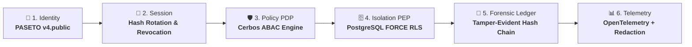
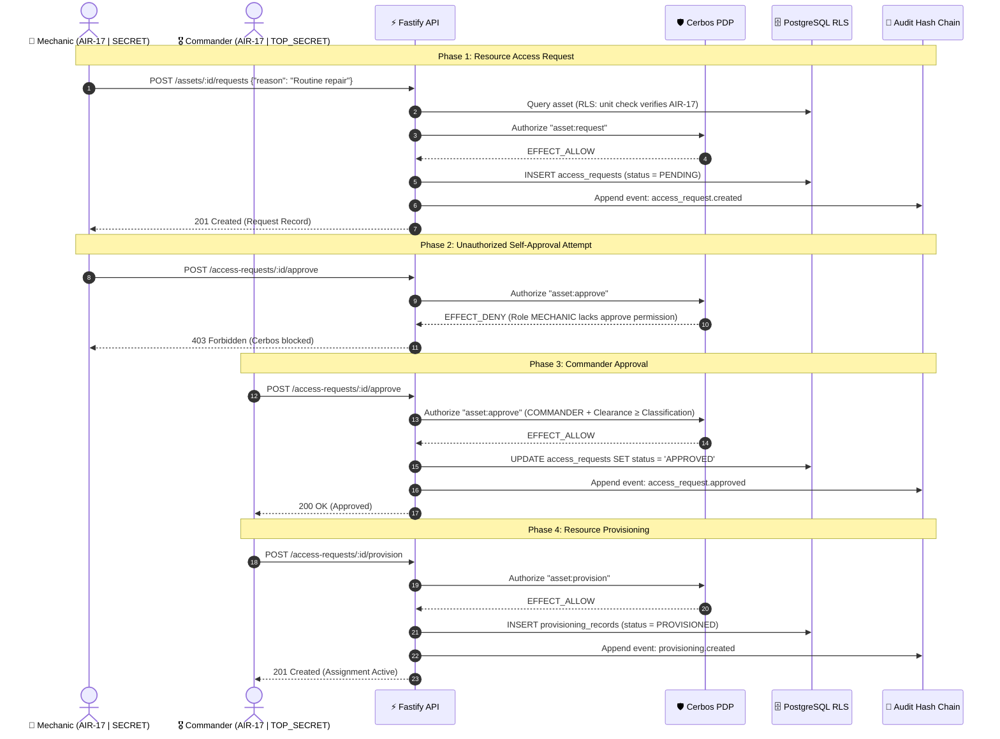
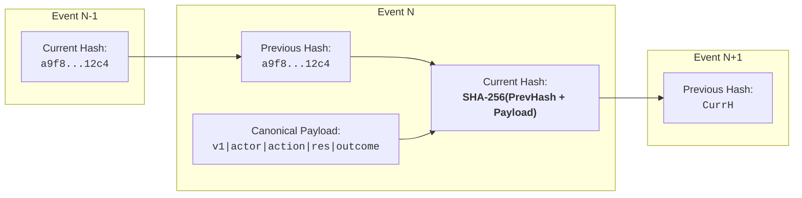

<div align="center">

# 🛡️ REDmesh
### Defense-Inspired Zero-Trust Resource Provisioning & Authorization Platform

*A layered security engineering architecture enforcing cryptographic identity, external ABAC policy decisions, PostgreSQL Row-Level Security, and a tamper-evident audit ledger.*

<br/>

[](https://redmesh.spacekid.xyz)
[](https://redmesh-api.onrender.com)
[](https://redmesh-api.onrender.com/health)

<br/>

[](https://www.typescriptlang.org/)
[](https://nodejs.org/)
[](https://fastify.dev/)
[](https://nextjs.org/)
[](https://www.postgresql.org/)
[](https://paseto.io/)
[](https://www.cerbos.dev/)
[](https://opentelemetry.io/)
[](https://www.docker.com/)

<br/>

[**🌐 Live Application**](https://redmesh.spacekid.xyz) • [**⚡ Production API**](https://redmesh-api.onrender.com) • [**📖 Architecture Blueprint**](docs/ARCHITECTURE.md) • [**🎯 Threat Model**](docs/THREAT_MODEL.md) • [**🚀 Deployment Guide**](docs/DEPLOYMENT.md)

---

</div>

<br/>

> [!NOTE]
> **Project Scope Disclaimer:** REDmesh is a fictional, defense-inspired software architecture project created for demonstration and educational purposes in zero-trust engineering. It is **not** real military infrastructure, is not affiliated with any defense department or military organization, and does **not** host, handle, or process classified or real military data.

---

## 📌 Executive Overview

In conventional applications, security is often treated as a single perimeter: an API gateway verifies a JSON Web Token, and subsequent database operations run with unfettered database permissions. If the token is forged, application logic fails, or an Insecure Direct Object Reference (IDOR/BOLA) occurs, the entire datastore is exposed.

**REDmesh** rejects the single-perimeter assumption. Built as an end-to-end access request, approval, and provisioning platform for sensitive resources across operational units, it structures security into **six independent, complementary defense boundaries**:


```mermaid
flowchart LR
    A["🔑 1. Identity<br/><b>PASETO v4.public</b>"] --> B["🔄 2. Session<br/><b>Hash Rotation & Revocation</b>"]
    B --> C["🛡️ 3. Policy PDP<br/><b>Cerbos ABAC Engine</b>"]
    C --> D["🗄️ 4. Isolation PEP<br/><b>PostgreSQL FORCE RLS</b>"]
    D --> E["🔗 5. Forensic Ledger<br/><b>Tamper-Evident Hash Chain</b>"]
    E --> F["📊 6. Telemetry<br/><b>OpenTelemetry + Redaction</b>"]
```

Every access request requires:
1. Cryptographic signature and expiration verification (PASETO v4).
2. Live database session validity and family theft detection.
3. Decoupled policy evaluation against user clearance vs. resource classification (Cerbos).
4. Physical row isolation at the database layer (PostgreSQL RLS fails closed).
5. Immutable, serialized audit recording linked by cryptographic digests.

---

## 🏛️ System Architecture

```mermaid
flowchart TD
    Client(["🌐 Client Browser / Next.js 14 Frontend"])
    
    subgraph Host ["Single-Host / Cloud Runtime"]
        subgraph Gateway ["Reverse Proxy & Edge"]
            Proxy["Caddy / Cloud Ingress (TLS Termination)"]
        end

        subgraph Application ["Application Core"]
            Fastify["Fastify 5 API Server (TypeScript)"]
            OTel["OpenTelemetry Instrumentation + PII Redaction"]
            AuthModule["Auth & Session Manager (Argon2id + PASETO)"]
            AuthzModule["Authorization Dispatcher"]
        end

        subgraph SecurityPDP ["External Policy Decision Point"]
            Cerbos["Cerbos Engine (PDP Container :3592)"]
            Policies[("redmesh_assets.yaml Policy Store")]
        end

        subgraph Persistence ["Storage & Isolation Engine"]
            PG["PostgreSQL 17 Database"]
            AuthRole["redmesh_auth (Stored Procedures Only)"]
            AppRole["redmesh_app (Least Privilege App Pool)"]
            RLS["FORCE ROW LEVEL SECURITY (Unit Scoping)"]
            AuditChain[("Cryptographic Audit Chain (Advisory Locked)")]
        end
    end

    Client -->|HTTPS:443| Proxy
    Proxy -->|Proxy /api/backend/*| Fastify
    Proxy -->|Proxy /*| Client
    Fastify <-->|Context & Spans| OTel
    Fastify --> AuthModule
    Fastify --> AuthzModule
    AuthzModule <-->|gRPC / HTTP Check| Cerbos
    Cerbos -.->|Evaluate| Policies
    AuthModule -->|Bootstrap / Verify| AuthRole
    Fastify -->|withRlsContext(app.user_id)| AppRole
    AppRole --> RLS
    Fastify -->|app_append_audit_event()| AuditChain
    RLS -.-> PG
```

---

## ⚡ Architecture Comparison: Traditional vs. REDmesh Zero-Trust

| Security Vector | ❌ Traditional Monolith / REST API | 🛡️ REDmesh Zero-Trust Platform |
| :--- | :--- | :--- |
| **Token Standard** | Standard JWT (vulnerable to `alg: none`, HMAC confusion) | **PASETO v4.public (Ed25519)** asymmetric signing — no cipher negotiation |
| **Session Control** | Stateless token only (cannot revoke until expiration) | **Server-side PostgreSQL sessions** with hash rotation & family theft revocation |
| **Password Storage** | BCrypt or SHA-256 | **Argon2id** (RFC 9106 memory-hard) with constant-time dummy verification |
| **Authorization** | Hardcoded `if (user.role === 'admin')` in route handlers | **Cerbos ABAC Policy Engine** evaluating dynamic role, clearance & classification |
| **Data Partitioning** | Application SQL queries (`WHERE unit_id = user.unit_id`) | **PostgreSQL `FORCE ROW LEVEL SECURITY`** enforced at database engine level |
| **Audit Records** | Plain text logs in stdout or mutable database table | **Tamper-evident SHA-256 cryptographic hash chain** locked by advisory transactions |
| **Observability** | Unredacted log streams leaking bearer tokens and hashes | **OpenTelemetry distributed tracing** with automated regex-based credential redaction |
| **Secret Ingestion** | Plaintext `.env` checked into repositories | **Dynamic Vault broker (local)** / **Deployment environment injection (cloud)** |

---

## 🎯 Dual-Custody Provisioning Workflow

Security-classified resources follow a strict **dual-custody lifecycle**: a requester cannot approve their own requests, and approval alone does not grant access until explicit provisioning occurs.


```mermaid
sequenceDiagram
    autonumber
    actor Mechanic as 🔧 Mechanic (AIR-17 | SECRET)
    actor Commander as 🎖️ Commander (AIR-17 | TOP_SECRET)
    participant API as ⚡ Fastify API
    participant Cerbos as 🛡️ Cerbos PDP
    participant DB as 🗄️ PostgreSQL RLS
    participant Audit as 🔗 Audit Hash Chain

    Note over Mechanic,Audit: Phase 1: Resource Access Request
    Mechanic->>API: POST /assets/:id/requests {"reason": "Routine repair"}
    API->>DB: Query asset (RLS: unit check verifies AIR-17)
    API->>Cerbos: Authorize "asset:request"
    Cerbos-->>API: EFFECT_ALLOW
    API->>DB: INSERT access_requests (status = PENDING)
    API->>Audit: Append event: access_request.created
    API-->>Mechanic: 201 Created (Request Record)

    Note over Mechanic,Audit: Phase 2: Unauthorized Self-Approval Attempt
    Mechanic->>API: POST /access-requests/:id/approve
    API->>Cerbos: Authorize "asset:approve"
    Cerbos-->>API: EFFECT_DENY (Role MECHANIC lacks approve permission)
    API-->>Mechanic: 403 Forbidden (Cerbos blocked)

    Note over Commander,Audit: Phase 3: Commander Approval
    Commander->>API: POST /access-requests/:id/approve
    API->>Cerbos: Authorize "asset:approve" (COMMANDER + Clearance ≥ Classification)
    Cerbos-->>API: EFFECT_ALLOW
    API->>DB: UPDATE access_requests SET status = 'APPROVED'
    API->>Audit: Append event: access_request.approved
    API-->>Commander: 200 OK (Approved)

    Note over Commander,Audit: Phase 4: Resource Provisioning
    Commander->>API: POST /access-requests/:id/provision
    API->>Cerbos: Authorize "asset:provision"
    Cerbos-->>API: EFFECT_ALLOW
    API->>DB: INSERT provisioning_records (status = PROVISIONED)
    API->>Audit: Append event: provisioning.created
    API-->>Commander: 201 Created (Assignment Active)
```

---

## 🔗 Tamper-Evident Cryptographic Audit Ledger

Audit events are persisted sequentially in PostgreSQL. Each entry computes a SHA-256 digest over a strictly canonicalized string representation of the event and binds it cryptographically to the preceding event's digest:


```mermaid
flowchart LR
    subgraph Event1 ["Event N-1"]
        H1["Current Hash:<br/><code>a9f8...12c4</code>"]
    end

    subgraph Event2 ["Event N"]
        PrevH["Previous Hash:<br/><code>a9f8...12c4</code>"]
        Payload["Canonical Payload:<br/><code>v1|actor|action|res|outcome</code>"]
        CurrH["Current Hash:<br/><b>SHA-256(PrevHash + Payload)</b>"]
        PrevH --> CurrH
        Payload --> CurrH
    end

    subgraph Event3 ["Event N+1"]
        NextPrev["Previous Hash:<br/><code>CurrH</code>"]
    end

    H1 --> PrevH
    CurrH --> NextPrev
```

### Forensic Guarantees:
* **Delimiter-Ambiguity Resistance:** Uses `canonicalizeV1()` to encode field lengths and values unambiguously, preventing collision attacks.
* **Database Privilege Denial:** The runtime application user `redmesh_app` has `REVOKE INSERT, UPDATE, DELETE` on the table.
* **Advisory Locked Appends:** Serial position numbers (`chain_position`) and hash chaining are generated exclusively through a `SECURITY DEFINER` function (`app_append_audit_event`) protected by a PostgreSQL transaction advisory lock (`pg_advisory_xact_lock`).
* **Instant Verification:** The `/audit/integrity` endpoint scans the chain sequentially; if any row, payload, or historical hash is modified or deleted, verification immediately flags the exact index of tampering.

---

## 🧑‍💻 Evaluation Personas & Access Matrix

The live application includes an **Evaluation Personas (Demo Mode)** switcher so you can evaluate how clearance, organizational units, and role permissions interact:

| Persona | Role | Clearance Level | Unit | Operational Scope & Permissions |
| :--- | :--- | :--- | :--- | :--- |
| **Rahul Sharma** | `MECHANIC` | `SECRET` | `AIR-17` | Can view Unit AIR-17 assets up to SECRET; create access requests; cannot approve or provision. |
| **Alex Vance** | `COMMANDER` | `TOP_SECRET` | `AIR-17` | Can approve and provision access requests for Unit AIR-17 assets up to TOP_SECRET clearance. |
| **Elena Rostova** | `COMMANDER` | `TOP_SECRET` | `NAV-04` | Unit isolation check: cannot view, approve, or provision AIR-17 assets (PostgreSQL RLS fails closed with 404). |
| **Marcus Brody** | `AUDITOR` | `TOP_SECRET` | `HQ-GLOBAL` | Unrestricted read-only visibility into the cryptographic audit chain and real-time chain verification. |
| **Admin Root** | `ADMIN` | `TOP_SECRET` | `HQ-GLOBAL` | Platform administration, health checks, and global system configuration. |

---

## 🖥️ Application Showcase

<div align="center">

### 1. Zero-Trust Sign In & Persona Selector
*Authenticate with standard credentials or switch instant security personas for live role evaluation.*

```
┌────────────────────────────────────────────────────────────────────────┐
│                        [ REDmesh Secure Sign In ]                      │
│                                                                        │
│   Username: [ alex.vance                              ]                │
│   Password: [ •••••••••••••••••••••                   ]                │
│                                                                        │
│   [ Quick Persona Switcher ]                                           │
│   • Rahul (Mechanic / AIR-17)     • Alex (Commander / AIR-17)         │
│   • Elena (Commander / NAV-04)    • Marcus (Auditor / HQ)              │
└────────────────────────────────────────────────────────────────────────┘
```
*(Upload your screenshot here: ``)*

<br/>

### 2. Live Resource Dashboard
*Real-time visibility into unit-scoped assets, pending approvals, and active assignments.*

```
┌────────────────────────────────────────────────────────────────────────┐
│  AIR-17 ASSET INVENTORY              PENDING ACCESS REQUESTS (1)       │
│  ──────────────────────────────────  ────────────────────────────────  │
│  • F-22 Avionics Core   [TOP_SECRET] • Drone Telemetry Pod             │
│  • Tactical Radar Bus   [SECRET]       Requester: Rahul Sharma         │
│  • Hydraulic Actuator   [CONFID.]      Status: [ PENDING COMMANDER ]   │
└────────────────────────────────────────────────────────────────────────┘
```
*(Upload your screenshot here: ``)*

<br/>

### 3. Cryptographic Audit Log & Verification
*Inspect SHA-256 chained events and trigger live cryptographic integrity verifications.*

```
┌────────────────────────────────────────────────────────────────────────┐
│  AUDIT CHAIN STATUS: [ VALID ] • 7 EVENTS VERIFIED • ZERO TAMPERING    │
│  ────────────────────────────────────────────────────────────────────  │
│  #7  2026-09-22  provisioning.created     Hash: 3c1a...7f4e [OK]       │
│  #6  2026-09-22  access_request.approved  Hash: 8b4d...2e10 [OK]       │
│  #5  2026-09-22  access_request.created   Hash: 11f0...9aa3 [OK]       │
└────────────────────────────────────────────────────────────────────────┘
```
*(Upload your screenshot here: ``)*

</div>

---

## 🛠️ Complete Technology Stack

```text
REDmesh Platform
├── Backend API Layer
│   ├── Fastify 5.x (High-throughput encapsulated HTTP server)
│   ├── Node.js 22+ & TypeScript 5.x (Strict type safety)
│   ├── PASETO v4.public (Ed25519 asymmetric token cryptography)
│   ├── Argon2id (Memory-hard password hashing via RFC 9106)
│   ├── OpenTelemetry NodeSDK (W3C trace propagation & Prometheus metrics :9464)
│   └── Pino Logger (Automated regex token/password redaction)
├── Authorization & Policy
│   └── Cerbos 0.55.0 (External PDP container; declarative YAML ABAC policies)
├── Storage & Database Security
│   ├── PostgreSQL 17 (Relational store)
│   ├── FORCE ROW LEVEL SECURITY (Unit & tenant isolation PEP)
│   ├── Dual Database Roles (redmesh_auth vs. redmesh_app least-privilege)
│   └── PostgreSQL Advisory Locks (pg_advisory_xact_lock serial audit hashing)
├── Frontend UI
│   ├── Next.js 14 (App Router & Standalone Docker output)
│   ├── React 18 & Tailwind CSS (Dark-themed zero-trust HUD)
│   └── Lucide React (System icons)
└── Infrastructure & Deployment
    ├── Docker & Docker Compose V2 (Local multi-service orchestration)
    ├── Caddy 2 (Reverse proxy, security headers, automatic Let's Encrypt TLS)
    ├── Render (Production containerized API hosting)
    └── Supabase / OCI (Production PostgreSQL 17)
```

---

## 🔌 API Reference & Endpoints

All authenticated routes expect: `Authorization: Bearer <PASETO_V4_TOKEN>`

| Method | Endpoint | Access Level | Description |
| :--- | :--- | :--- | :--- |
| `GET` | `/health` | Public | Liveness probe returning service and environment status. |
| `GET` | `/health/db` | Public | Deep readiness probe verifying active PostgreSQL connection pool. |
| `GET` | `/auth/demo-credentials` | Public | Returns pre-configured evaluation accounts for quick inspection. |
| `POST` | `/auth/login` | Public | Authenticates credentials, issues PASETO token & hashed refresh session. |
| `POST` | `/auth/refresh` | Authenticated | Rotates access token and refresh token (revokes family on reuse). |
| `POST` | `/auth/logout` | Authenticated | Explicitly revokes active session family in PostgreSQL. |
| `GET` | `/auth/me` | Authenticated | Resolves caller identity, clearance level, role, and unit affiliation. |
| `GET` | `/assets` | RLS Scoped | Returns assets filtered strictly to caller's unit via PostgreSQL RLS. |
| `GET` | `/assets/:id` | RLS Scoped | Fetches single asset (fails closed with 404 if outside caller's unit). |
| `POST` | `/assets/:id/requests` | Cerbos Gated | Creates new access request (`asset:request` policy check). |
| `GET` | `/access-requests` | RLS Scoped | Lists access requests for caller's unit. |
| `POST` | `/access-requests/:id/approve` | Cerbos Gated | Approves access request (`COMMANDER` role + clearance check). |
| `POST` | `/access-requests/:id/provision` | Cerbos Gated | Provisions approved request into active assignment. |
| `GET` | `/provisioning` | RLS Scoped | Lists active provisioning records. |
| `POST` | `/provisioning/:id/revoke` | Cerbos Gated | Explicitly revokes active provisioning assignment. |
| `GET` | `/audit/events` | Auditor / Admin | Retrieves recent audit events with hash signatures. |
| `GET` | `/audit/integrity` | Auditor / Admin | Executes cryptographic verification scan over entire audit chain. |

*Detailed request/response payloads and error schemas are documented in [docs/API.md](docs/API.md).*

---

## 🧪 Comprehensive Security Test Suite

The platform enforces automated regression tests covering all security boundaries:

```bash
npm test
```

```text
TAP version 13
# Subtest: Audit Security (3 tests)
  ok 1 - Legitimate audit events form a valid chain
  ok 2 - Modifying an event's content causes verification to fail
  ok 3 - Modifying a previous hash causes verification to fail
# Subtest: Authentication Security (4 tests)
  ok 1 - Valid login succeeds
  ok 2 - Invalid password is rejected
  ok 3 - Unknown username is rejected
  ok 4 - Missing/invalid authentication token is rejected
# Subtest: Frontend API & Workflows Integration (15 tests)
  ok 1..15 - Complete end-to-end access request, approval, RLS filtering, and audit verification
# Subtest: PASETO Security (4 tests)
  ok 1 - Valid PASETO verifies
  ok 2 - Tampered token fails verification
  ok 3 - Token with invalid purpose is rejected
  ok 4 - Expired token is rejected
# Subtest: Provisioning Security (4 tests)
  ok 1 - Mechanic can request access
  ok 2 - Mechanic cannot approve the request (Cerbos 403)
  ok 3 - Commander can approve the request
  ok 4 - Mechanic cannot provision
# Subtest: Session Security (4 tests)
  ok 1 - Valid login creates session
  ok 2 - Refresh rotates credentials
  ok 3 - Reusing old refresh token revokes entire session family
  ok 4 - Logout invalidates session
# Subtest: Targeted Productization & Workflow Verification (7 tests)
  ok 1..7 - Verified identity resolution, denial boundaries, and cryptographic verification
# tests 52
# pass 52
# fail 0
```

> [!NOTE]
> Tests run with `--test-concurrency=1` because stateful test cases intentionally inject cryptographic corruptions into temporary database rows to prove that verification detects tampering, and subsequently restore the chain.

---

## 🚀 Quickstart & Local Development

### Prerequisites
* **Docker Desktop** (Engine 24+, Compose V2)
* **Node.js** 20.x or 22.x LTS
* **PowerShell** (Windows) or **bash** (Linux/macOS)

### 1. Clone & Install Dependencies
```bash
git clone https://github.com/RASH-2137/REDmesh.git
cd REDmesh
npm install
cd frontend && npm install && cd ..
```

### 2. Start Development Containers
Launch PostgreSQL 17 (port 5433), Cerbos 0.55.0 (port 3592), and HashiCorp Vault (port 8200):
```bash
docker compose up -d
```

### 3. Ingest Secrets & Initialize Database
In local dev, runtime secrets are loaded into HashiCorp Vault's in-memory KV engine:
```powershell
# Ingest asymmetric keys & credentials into Vault
powershell -ExecutionPolicy Bypass -File ./scripts/load-secrets-to-vault.ps1

# Run migrations and seed baseline evaluation data
npx tsx src/scripts/deploy-init-db.ts
```

### 4. Run Verification Suite
```bash
npm test
```

### 5. Launch Backend & Frontend
```bash
# Terminal 1: Backend API (http://127.0.0.1:3000)
npm run dev

# Terminal 2: Next.js Frontend (http://localhost:3001)
cd frontend
npm run dev
```

---

## 📦 Production Deployment & Containerization

In production, REDmesh deploys using [`docker-compose.prod.yml`](docker-compose.prod.yml) with strict network segmentation:

```bash
# Build multi-stage production images (Alpine with pruned dependencies)
docker compose -f docker-compose.prod.yml build

# Run automated deployment migrations & cryptographic audit initialization
docker compose -f docker-compose.prod.yml run --rm backend npx tsx src/scripts/deploy-init-db.ts

# Start production cluster
docker compose -f docker-compose.prod.yml up -d
```

* **Zero Host Port Leakage:** PostgreSQL (`5432`), Cerbos (`3592`), Fastify (`3000`), and OTel (`9464`) are restricted strictly to the private internal Docker bridge (`redmesh-internal`).
* **Ingress Security:** Only Caddy exposes public ports (`80` & `443`), terminating TLS automatically and reverse-proxying API routes.
* Full production deployment instructions, backup scripts, and OCI compute setup are available in [docs/DEPLOYMENT.md](docs/DEPLOYMENT.md).

---

## 📂 Repository Directory Layout

```text
REDmesh/
│
├── README.md                          # Main project entry point & overview
│
├── docs/                              # Deep technical documentation
│   ├── API.md                         # Complete REST endpoint contracts & payloads
│   ├── ARCHITECTURE.md                # System design, trust boundaries & data flows
│   ├── AUDIT_CHAIN.md                 # Canonicalization algorithm & hash specifications
│   ├── DEPLOYMENT.md                  # Container topology, cloud VM & runbook guide
│   ├── SECURITY.md                    # Core security policies & defense-in-depth model
│   └── THREAT_MODEL.md                # STRIDE attack vectors & mitigation matrix
│
├── src/                               # Fastify TypeScript Backend
│   ├── config/                        # Database pools & fail-fast env validation
│   ├── modules/                       # Domain logic (auth, assets, audit, provisioning)
│   ├── routes/                        # Encapsulated Fastify route controllers
│   ├── observability/                 # OpenTelemetry tracer & metric collectors
│   ├── scripts/                       # Migration runner, keygen & password utilities
│   ├── bootstrap.ts                   # Fail-fast startup orchestrator
│   ├── index.ts                       # Fastify application server instance
│   └── instrumentation.ts             # OpenTelemetry auto-instrumentation hook
│
├── frontend/                          # Next.js 14 Web Application
│   ├── src/app/                       # App Router pages (login, assets, requests, audit)
│   ├── src/components/                # UI widgets, badges, identity avatars & modals
│   ├── src/lib/                       # API clients & authentication context provider
│   └── Dockerfile                     # Multi-stage standalone Next.js container
│
├── database/                          # Persistence Layer
│   ├── migrations/                    # Canonical migrations 001 through 014
│   └── seeds/                         # Clean workflow baseline data (002_clean_workflow_data.sql)
│
├── cerbos/                            # Authorization Layer
│   └── policies/                      # Declarative ABAC policies (redmesh_assets.yaml)
│
├── tests/                             # Automated Test Suites (52 tests)
├── scripts/                           # Local development helper scripts
│
├── Dockerfile.backend                 # Multi-stage unprivileged Alpine backend image
├── Caddyfile                          # Automated Let's Encrypt TLS reverse proxy configuration
├── docker-compose.yml                 # Local development infrastructure dependencies
├── docker-compose.prod.yml            # Full production 5-container orchestration
├── package.json
└── tsconfig.json
```

---

## 📚 Technical Documentation Index

For deep dives into the platform's security mechanisms, explore the dedicated documentation guides:

| Document | Primary Focus |
| :--- | :--- |
| [**Architecture Blueprint**](docs/ARCHITECTURE.md) | Six trust boundaries, component decoupling, and sequence diagrams. |
| [**Threat Model**](docs/THREAT_MODEL.md) | STRIDE analysis, threat actors, attack vectors, and residual risks. |
| [**Security Policy & Controls**](docs/SECURITY.md) | RLS isolation rules, dummy password timing defenses, and token lifetimes. |
| [**Audit Chain Specification**](docs/AUDIT_CHAIN.md) | Canonicalization algorithm (`canonicalizeV1`), SHA-256 chaining, and verifier logic. |
| [**API Reference**](docs/API.md) | Exact schema definitions, HTTP status codes, and curl examples. |
| [**Deployment Guide**](docs/DEPLOYMENT.md) | Multi-container production deployment, OCI VM setup, and backup procedures. |

---

<div align="center">

### Built by **Rahul Sharma**
*Zero-Trust Security • Backend Engineering • Distributed Systems*

[](https://github.com/RASH-2137)
[](https://redmesh.spacekid.xyz)

</div>
