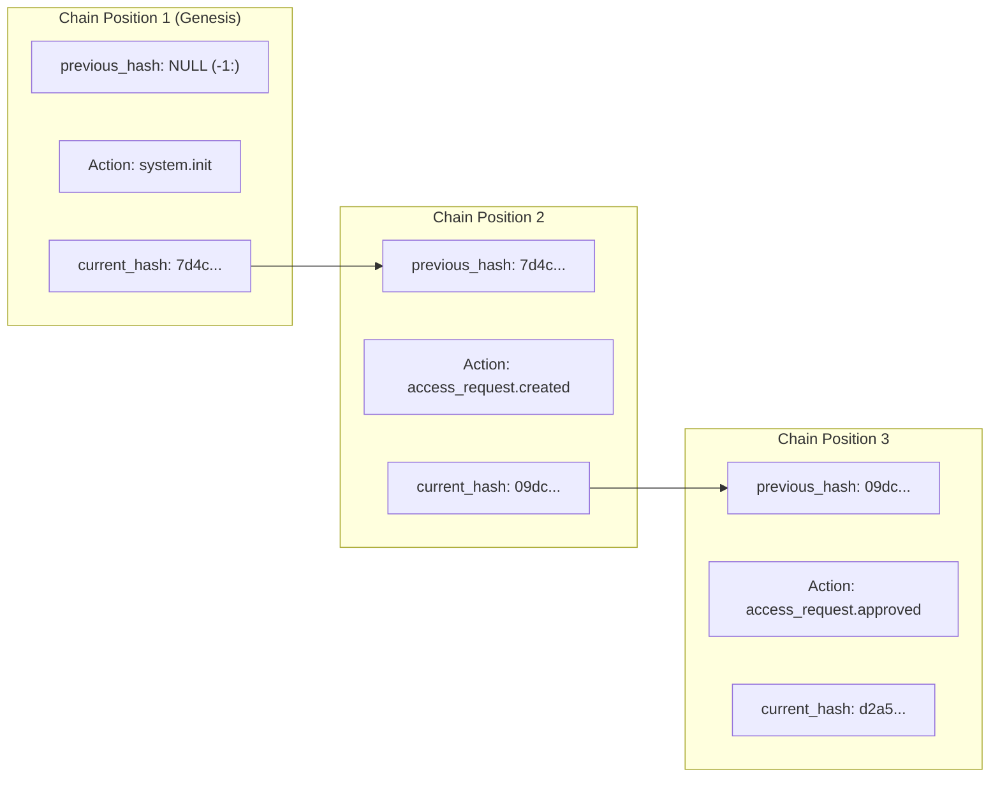

# Tamper-Evident Cryptographic Audit Chain Specification

## 1. Overview & Purpose

In zero-trust and mission-critical systems, post-incident forensics and compliance verification require guarantees that logs cannot be secretly altered, deleted, or reordered after the fact.

Sovereign SecureMesh (REDmesh) implements a **tamper-evident cryptographic audit chain** directly in PostgreSQL. Every security-relevant action computes a SHA-256 digest over a strictly canonicalized byte representation of the event and cryptographically binds it to the digest of the preceding event.

> [!NOTE]
> **Terminology & Guarantees:** This is a **tamper-evident cryptographic audit chain**, not an "immutable blockchain". While the database role `redmesh_app` is physically prevented from modifying or deleting audit rows, an attacker possessing superuser credentials or raw physical disk access could theoretically rewrite historical rows. However, any modification or deletion invalidates the cryptographic hash chain, making tampering immediately detectable upon verification.

---

## 2. Event Structure

Audit events are persisted in the `audit_events` table with the following schema:

```sql
CREATE TABLE audit_events (
    id UUID PRIMARY KEY DEFAULT gen_random_uuid(),
    occurred_at TIMESTAMPTZ NOT NULL DEFAULT NOW(),
    actor_user_id UUID REFERENCES users(id),
    action TEXT NOT NULL,
    resource_type TEXT,
    resource_id UUID,
    result TEXT NOT NULL,
    reason TEXT,
    request_id TEXT,
    trace_id TEXT,
    previous_hash TEXT,
    current_hash TEXT,
    schema_version INTEGER NOT NULL DEFAULT 1,
    chain_position BIGINT NOT NULL UNIQUE DEFAULT nextval('audit_event_chain_position_seq')
);
```

### Field Definitions

| Field Name | Type | Description |
| :--- | :--- | :--- |
| `id` | `UUID` | Unique identifier for the audit event record. |
| `occurred_at` | `TIMESTAMPTZ` | Timestamp captured via `clock_timestamp()` during transaction execution. |
| `actor_user_id` | `UUID` (Nullable) | User UUID extracted from `app.user_id` in the authenticated session context. |
| `action` | `TEXT` | Operational verb (e.g., `access_request.created`, `provisioning.revoked`). |
| `resource_type` | `TEXT` | Entity type affected (e.g., `access_request`, `provisioning`, `asset`). |
| `resource_id` | `UUID` (Nullable) | Primary key of the affected domain resource. |
| `result` | `TEXT` | Outcome of the operation (`SUCCESS` or `FAILURE`). |
| `reason` | `TEXT` (Nullable) | Contextual rationale or failure description. |
| `request_id` | `TEXT` (Nullable) | Correlation identifier from the Fastify HTTP request. |
| `trace_id` | `TEXT` (Nullable) | Distributed trace identifier propagated from OpenTelemetry. |
| `previous_hash` | `TEXT` (Nullable) | SHA-256 digest of the immediate predecessor event (`NULL` for genesis). |
| `current_hash` | `TEXT` | SHA-256 hex digest of the canonical string for this event. |
| `schema_version` | `INTEGER` | Format version of the canonicalization scheme (currently `1`). |
| `chain_position` | `BIGINT` | Strictly monotonically increasing sequence number (`audit_event_chain_position_seq`). |

---

## 3. Canonicalization Algorithm (`canonicalizeV1`)

A common vulnerability in hash-chain implementations is **delimiter ambiguity**: if an attacker injects delimiter characters (such as `|` or `=`) into user-controlled fields (like `reason`), the boundaries between fields shift, allowing hash collision attacks.

REDmesh prevents delimiter attacks through **byte-length prefixed encoding**:

### Value Encoding Rule
Every field value is encoded as:
$$\text{encoded}(v) = \begin{cases} \text{"-1:"} & v \text{ is NULL} \\ \text{length}(v) + \text{":"} + v & v \text{ is NOT NULL} \end{cases}$$

### Full Canonical Payload
The canonical representation concatenates 12 key-value pairs separated by the pipe (`|`) delimiter:

```
schema_version=1:1|chain_position=<len>:<pos>|occurred_at=<len>:<iso-timestamp>|actor_user_id=<len>:<uuid>|action=<len>:<act>|resource_type=<len>:<type>|resource_id=<len>:<uuid>|result=<len>:<res>|reason=<len>:<reason>|request_id=<len>:<req>|trace_id=<len>:<trace>|previous_hash=<len>:<prev>
```

#### Timestamp Formatting
To ensure byte-for-byte reproducibility between PostgreSQL PL/pgSQL and Node.js TypeScript:
* Timestamp is formatted in UTC with microsecond precision:
  `YYYY-MM-DD"T"HH24:MI:SS.US"Z"`

---

## 4. Chain Linkage & Genesis State



1. **Genesis Event (`chain_position = 1`):**
   * The very first event inserted has no predecessor.
   * `previous_hash` is `NULL` (canonical value: `-1:`).
   * Its `current_hash` is computed from its own data and the null predecessor indicator.
2. **Successor Events (`chain_position > 1`):**
   * The stored procedure selects the `current_hash` of the row with the highest `chain_position`:
     ```sql
     SELECT ae.current_hash INTO v_previous_hash
     FROM audit_events AS ae
     ORDER BY ae.chain_position DESC
     LIMIT 1;
     ```
   * The new event stores this digest in its `previous_hash` column.
   * Its `current_hash` is computed as:
     $$\text{current\_hash} = \text{encode}(\text{digest}(\text{convert\_to}(v\_canonical, \text{'UTF8'}), \text{'sha256'}), \text{'hex'})$$

---

## 5. Append-Only Security & Database Permissions

Application code cannot execute raw `INSERT`, `UPDATE`, or `DELETE` statements on the `audit_events` table:

```sql
-- Revoke direct table mutation from application role
REVOKE INSERT, UPDATE, DELETE ON audit_events FROM redmesh_app;

-- Force RLS even for the table owner
ALTER TABLE audit_events FORCE ROW LEVEL SECURITY;

-- Grant execution strictly to the security-definer stored procedure
GRANT EXECUTE ON FUNCTION app_append_audit_event TO redmesh_app;
```

* All audit rows are created via `app_append_audit_event()`.
* The function executes as `SECURITY DEFINER` with `SET search_path = public, pg_temp`, preventing search-path hijacking attacks.

---

## 6. Verification Engine (`verifyAuditChain`)

Verification is initiated via `GET /audit/integrity` (restricted to users with role `AUDITOR` or `ADMIN`).

The verification algorithm (`src/modules/audit/verifier.ts`) processes all rows ordered by `chain_position ASC`:

```typescript
let previousHash: string | null = null;

for (const event of events) {
    // 1. Schema version check
    if (event.schemaVersion !== 1) {
        return { valid: false, firstInvalidPosition: event.chainPosition, reason: "Unsupported audit schema version" };
    }

    // 2. Linkage check: previous_hash must match prior event's current_hash
    if (event.previousHash !== previousHash) {
        return { valid: false, firstInvalidPosition: event.chainPosition, reason: `Previous hash mismatch at position ${event.chainPosition}` };
    }

    // 3. Content integrity check: recompute SHA-256 over canonical string
    const canonical = canonicalizeV1(event);
    const expectedHash = hashCanonicalValue(canonical);
    if (event.currentHash !== expectedHash) {
        return { valid: false, firstInvalidPosition: event.chainPosition, reason: `Current hash mismatch at position ${event.chainPosition}` };
    }

    // Advance pointer
    previousHash = event.currentHash;
}

return { valid: true, eventCount: events.length, firstInvalidPosition: null, reason: null };
```

### Tamper Detection Modes
1. **Content Modification:** If an attacker alters `action`, `actor_user_id`, or `result`, the recalculated SHA-256 fails to match `current_hash`. The verifier flags:
   `"Current hash mismatch at position N"`.
2. **Reordering / Deletion / Insertion:** If an attacker removes a row or inserts a forged row, the sequential linkage breaks: `event.previousHash !== previousHash`. The verifier flags:
   `"Previous hash mismatch at position N"`.

---

## 7. Concurrency, Serialization & Production Ordering

### Database-Level Concurrency: Advisory Transaction Locking
To guarantee that concurrent API requests do not select the same chain head or fork the sequence, `app_append_audit_event()` uses a dedicated PostgreSQL transaction advisory lock:

```sql
PERFORM pg_advisory_xact_lock(735921846201);
```

* **Lock Scope:** The advisory lock is transaction-scoped (`xact`). It is held from the moment audit append begins until the wrapping transaction issues `COMMIT` or `ROLLBACK`.
* **Behavior:** Concurrent transactions attempting to append an audit event queue sequentially, ensuring deterministic allocation of `chain_position` and consistent `previous_hash` retrieval.

### Test Concurrency Discovery (Phase 10)
During Phase 10 development, automated tests running with default parallel execution interfered with the sequential audit chain:
* Multiple test runners created and tampered with audit rows concurrently in the shared database.
* One test suite's deliberate tampering broke the chain verification check running simultaneously in another suite.

To ensure deterministic test execution, the test suite runner is configured with:
```json
"test": "tsx --import dotenv/config --test --test-concurrency=1 tests/**/*.test.ts"
```

> [!IMPORTANT]
> **Single-Concurrency Tests $\neq$ Production Concurrency Architecture:**
> Serializing test execution with `--test-concurrency=1` solves test-runner determinism in a shared test database where tests deliberately mutate audit state. It is **not** an architectural solution for high-throughput production workloads.
>
> In production environments:
> 1. **Advisory locking** provides strict write serialization for single-instance PostgreSQL deployments.
> 2. For **high-throughput distributed microservices**, serial database advisory locking can become a throughput bottleneck. Production architectures scaling beyond single-node transactional capacity should transition to a **partitioned event-stream architecture** (e.g., Kafka/Redpanda topic with single-partition ordering, or an append-only cryptographic ledger service).
